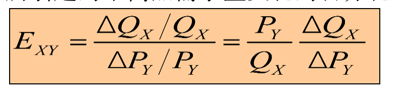

## 第一章 导论

权衡与选择：消费者、生产者，根据价格和市场信息做出最有利于自己的决策。

价格和市场：不同的市场结构中，消费者和生产者有不同的市场力量，市场中每个个体的决策方式最终决定了均衡的市场价格。

不同的市场结构，价格的决定方式不同。

对大国而言，进口增加时，进口价格提高；出口增加时，出口价格下降，我们称为贸易条件（出口品世界价格/进口品世界价格）恶化 ，导致福利下降

所有市场达到均衡，形成一般均衡的价格体系，价格体系决定了资源配置的状况。
效率评判：帕累托效率是市场价格体系所能达到的最优资源配置状态

## 第二章 供给需求基本原理

### 需求

需求：消费者在一定时期内，在一既定的价格水平下**愿意**而且能够购买的商品或服务的数量。需求是**购买意愿**和**支付能力**的统一。

影响因素：价格、收入、替代品价格、互补品价格、 Taste、预期、人口的数量与结构

正常物品： 在其他条件相同时，收入增加引起需求量增加的物品。

低档物品： 在其他条件相同时，收入增加引起需求量减少的物品。

当一种物品价格下降，替代品的需求减少，互补品需求增加

需求曲线表明，在**非价格因素保持不变**的条件下，对应于每一给定的价格水平，消费者愿意且能够购买的商品量。沿着需求曲线的消费者偏好保持不变。

### 供给

供给：在一定时期内，生产者在一既定的价格下愿意而且能够提供的商品量。供给是**供给意愿**和**供给能力**的统一。

影响因素：价格、生产成本、生产技术、相关商品价格、预期、产业政策

当一种物品价格下降，替代品的供给增加，互补品需求下降

### 市场

帕累托改进：不损害其他人的利益下，改善一些人的利益。帕累托最优：不存在帕累托改进。

供求分析的前提是市场必须是**竞争性**的

## 第三章 需求和供给弹性

### 需求弹性

* 需求价格弹性

一般而言，需求量Q和价格P之间呈反向关系，因此EP为负数。

EP 绝对值> 1：富有弹性

EP 绝对值= 1：单位弹性

EP 绝对值< 1：缺乏弹性

在需求富有弹性的情况下，卖者适当降低价格能增加总收入

在需求缺乏弹性的情况下，卖者降低价格会造成损失

影响因素：替代品的可得性、在预算上的比例（越大弹性越大）、调整期的长度

单位弹性的需求曲线总收入不变

* 需求收入弹性

* 需求的交叉价格弹性

另一种商品价格变化1%所引起的本商品需求量变化的百分化

替代品的交叉价格弹性为正

互补品的交叉价格弹性为负

### 供给弹性

影响因素：生产扩张的能力、调整时间

### 弧弹性

### 短期和长期弹性

通常短期弹性小于长期弹性

耐用品的短期需求弹性>长期（长期会被更新）

再生产品的短期供给弹性>长期

需求（或供给）减少30%：需求函数整体×0.7

需求曲线向左移动30%：常数项×0.7

## 第四章 消费者偏好

### 偏好关系

完备性：任何两个商品束可以比较

传递性

反身性：$A\geq A$

* 良态偏好的性质

单调性（非饱和性）：对每一种商品的消费都没有达到饱和点。对任何商品，总认为多比少好。

凸性：平衡优于极端。假设商品束x1,x0：

### 无差异曲线

向下倾斜、凸向原点、不能相交

极端情况，无差异曲线线退化成一点，例，字典偏好，满足基本假设

偏好：与收入、价格无关

### 边际替代率

为了获得一种商品而愿意放弃的另一种商品的数量，用斜率衡量；

**公式**$MRS_{xy}=-\frac{\Delta y}{\Delta x}$，放弃y轴商品获得一单位x轴商品，**注意负号**

边际替代率递减，由无差异曲线是凸保证

* 完全替代品：边际替代率是一个常数（完全不凸）

$u(x,y)=ax+by$

* 完全互补品：无差异曲线是直角（完全凸）

$ u(x,y)=min(ax，by)$

### 效用

表示满足程度。效用函数是偏好关系的数学描述

* 序数效用：根据各个消费束的偏好程度进行排序的效用函数。但是，它只是表示某消费束优于另一个消费束，至于优多少没有确切地表现出来。

* 基数效用：用效用函数来表示，它可以说明一个市场篮子优于另一个市场篮子的程度。

  

### 边际效用

边际效用递减

$MU_x=\frac{\partial U(x,y)}{\partial x}$

**边际替代率等于横坐标商品和纵坐标商品的边际效用的比值**

$MRS_{xy}=\frac{MU_x}{MU_y}=-斜率$

## 第五章 消费者选择

### 预算约束

预算线代表了花在每种商品上的总支出等于收入情况下，该消费者可购买的每种商品的所有组合。

$预算约束线斜率=-\frac{P_x}{P_y}$

预算约束反应的是消费者的购买能力

无差异曲线反应的是消费者的购买意愿

### 消费者选择

**消费者的心理价位和市场价格一样时，消费者才没有交换的动机，效用才是最大**

所以效用最大化条件：$MRS_{xy}=\frac{P_x}{P_y}$

$MRS_{xy}>\frac{P_x}{P_y}$时，增加X，减少Y

$MRS_{xy}<\frac{P_x}{P_y}$时，减少X，增加Y

* **边际相等原则**

此时$\frac{MU_x}{P_x}=\frac{MU_y}{P_y}$

* **收入税好于从量税**（画图）

### 例外

相切未必是最优选择：非凸偏好

最优未必相切：

折拗的偏好：e.g.完全互补

角点解：e.g.完全替代

### 角点解

$MRS_{xy}\neq\frac{P_x}{P_y}$

## 第六章 个人需求与市场需求

### 个人需求曲线

### 收入变化

### 恩格尔加总

### 市场需求

个人需求的加总；分段函数

### 网络外部性

* 攀比效应：需求曲线有弹性，降价促销

* 虚荣效应：需求曲线无弹性，提高价格

  

### 拉格朗日乘数法

### 对偶问题

## 第七章 替代效应和收入效应

价格发生变化时，会对消费者产生两种影响：

商品价格变动→商品**相对价格**变动→**替代效应**（效用水平不变）——需求量增加

商品价格变动→**实际购买力**的变动→**收入效应**（效用水平发生变化）——需求量可能增加也可能下降（正常品/劣等品）

**以“效用水平不变”表示购买力不变，这种分解方法称为Hicks；**

**以“依旧能购买原消费点”表示购买力不变，这种分解方法称为Slustsky**

* 正常品

* 劣等品

* 吉芬商品

非补偿需求（马歇尔需求）反映了收入效应和替代效应

补偿需求（希克斯需求）只反映了替代效应

希克斯需求弹性小于马歇尔需求

### 斯拉斯基方程

* 希克斯分解

### 汽油税

* 求收入效应和替代效应：先求出最终的需求x~2~，然后用U^*^解出I计算出希克斯需求h(x)，则x~2~-h(x)为收入效应，h(x)-x~1~为替代效应。

## 第八章 消费者剩余、显示偏好

### 希克斯补偿的等价变化和补偿变化

补偿变化（CV）：以**旧效用为基准**，例如，价格上升之后应该给消费者多少补偿多少钱，才能**和涨价之前一样好**。

等价变化（EV）：以新效用为基准，例如，价格上升之前从消费者那里拿走多少钱，使他和**涨价之后效用一样差**。

### 消费者剩余

### 显示偏好

* 直接显示偏好：同一条预算约束线下的两个点

* 间接显示偏好：两条预算约束线，通过交点利用传递性判断

### 显示偏好弱公理

若(p1,p2)时买得起(y1,y2)但买了(x1,x2)，则(q1,q2)时必定买不起(x1,x2)

（若一个选择点在另一个选择点的显示偏好范围内，则反过来必定在范围之外）

### 显示偏好强公理

如果商品束x直接或者间接地显示偏好于y，并且x,y不相同，那么y不可能直接或者间接地显示偏好于x

——具有良态偏好的理性行为的充分必要条件

