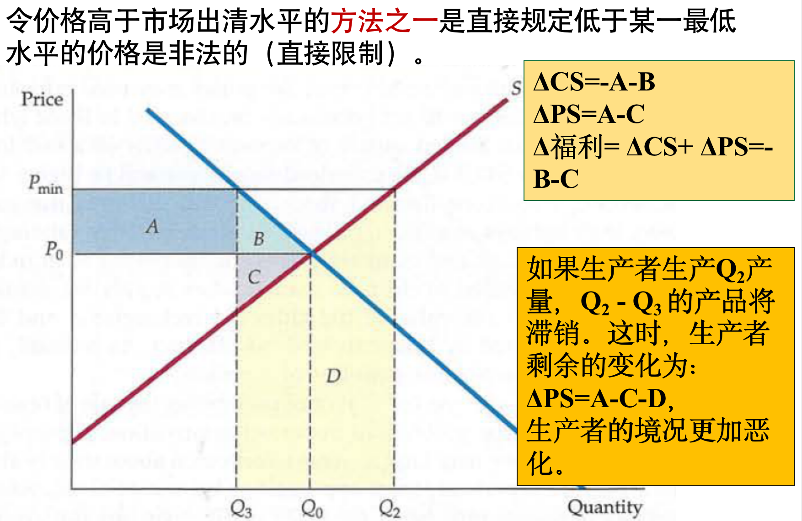

## 第九章 生产技术

生产函数$F(K,L)$，短期K不变L可变，长期均可变

### 短期生产函数

平均产量$AP=q/L$，边际产量$MP=\Delta q/\Delta L$

MP经过AP最高点，MP=0时为TP最高点

边际产出曲线先增后减

=>平均产出曲线先增后减

=>总产出曲线先增后减

### 边际报酬递减规律

另一种要素固定不变的时候，这种要素的边际产出，可能先增加，但最终都会递减

专业化分工=>缺乏效率

原因：固定生产要素的使用限制

假设：劳动者素质等同，生产技术不变

适用于长期

### 两种可变投入要素生产

等产量线：单增、凸性

$ F(tK1+(1-t)K2，tL1+(1-t)L2)\geq F(K2，L2)$

效用是序数的，生产函数是基数的

等产量线的斜率——边际技术替代率，$MRTS=MPL/MPK$（横轴为L，纵轴为K），即增加一单位劳动可以减少的资本的数量

$MRTS=-\Delta K/\Delta L$

边际技术替代率递减

$MPL=∂F(K,L)/ ∂L, MPK= ∂F(K,L)/ ∂K$

### 规模报酬

技术水平和要素价格不变的条件下，当**所有的投入要素按同一比例变动**时，产量变动的情况。

$F(tK,tM)=t^\lambda F(K,N)$

λ>1规模报酬递增，λ=1规模报酬不变，λ<1规模报酬递减

规模报酬递增因素：生产要素专用性、不可分性，生产规模维度效益

规模报酬递减因素：管理效率低下

往往在产出水平较低时，企业有规模报酬递增；但是产出提高后，将最终可能面临规模报酬不变和递减。

## 第十章 成本函数

会计成本：企业经营的历史成本，=货币支出+折旧

机会成本：未将资源用于其他用途放弃的机会产生的成本

沉没成本：已经发生而无法收回的成本

经济成本=机会成本

固定成本：不随产量变化。固定成本可以（部分）收回，沉没成本无法收回

资本的价格=使用资本的成本=资本的租金率=折旧率+利率

成本函数$C(q)$，因素：

①要素价格，假设给定

②使用要素多少，取决于生产技术

### 短期成本曲线

MC经过AVC、ATC最低点，ATC最低点在AVC最低点右边

ATC和AVC垂直距离逐渐减小

短期边际成本

### 长期成本曲线

成本最小化时

$MRTS= MPL/ MPK > w/r$，即 $r/MPK > w/MPL$，增加一单位产出的劳动成本相对较低，增加劳动减少资本

 ### 扩张路径

将每一产量和对应的最小成本画出来，得到扩张路径

**LAC、LMC为U型：规模报酬变化**

**SAC、SMC为U型：边际报酬递减**

完全竞争市场中，最优产量点在A点右侧部分

已知生产函数、要素价格，求成本函数：

* 短期

生产函数表示为L的函数，从而L表示为q的函数代入成本函数

* 长期

用$MPL/MPK=w/r$，$F(K,L)=q$联立求解$K,L$，得到$C$

### 规模经济

**投入要素之间的比例可变**，解释LAC曲线U型

如果双倍的产出需要的成本小于原来的两倍，则为规模经济，反之为规模不经济

规模报酬递增：当所有投入要素的数量都翻倍时，产量大于原来的两倍。

规模经济：当产量变为原来的两倍时，所需要的成本小于原来的两倍。

对齐次生产函数，规模报酬递增和规模经济等价

### 长期和短期成本曲线的关系

LAC曲线是SAC曲线的包络线

最小（SAC1）和最大(SAC3)规模企业的平均成本曲线的最低点不会位于长期平均成本曲线上

当LAC=SAC时，LMC=SMC

长期固定成本与短期固定成本？长期<短期（短期所有K都是固定成本）

长期可变成本与短期可变成本？不一定

## 第十一章 利润最大化与供给曲线

完全竞争市场假设：价格接受者、产品同质、自由进出

竞争性厂商利润最大化条件：$MR=MC=P$

在P上可以卖出任意多的产品

需求曲线

### 短期供给曲线

$P=SMC$，选择SMC上升阶段且MP=MC的产量

P在ATC和AVC之间时，虽然亏损但会生产（否则毁损固定成本），低于AVC则停止生产

**短期供给曲线为AVC之上的MC曲线**

短期内厂商利润可正可负

短期供给曲线向上倾斜。原因：要素的边际报酬递减规律

**分段！！！**

MC陡峭时供给弹性小

### 短期生产者剩余

生产者剩余=R-VC=MC和P之间的面积=矩形ABCD面积=P和供给曲线之间面积（绿色框）

MC下方面积是总可变成本

### 长期供给曲线

长期，厂商可以改变投入要素K,L

长期，生产函数和成本函数不同，最优产量不同。长期可能扩大或缩小工厂规模。

厂商也可决定退出其所在行业或进入其他行业。

**利润最大化条件$P=LMC=LAC$**

长期竞争性均衡的三个条件：

* 所有厂商在P=LMC都实现利润最大化。

* 经济利润为零。即P=LAC，没有任何厂商有动力进入或退出市场。

* 产品的价格是供给量与消费者需求量相等的均衡价格。

规模经济的行业往往有垄断性

 

市场长期供给曲线**不等于**单个厂商供给曲线的加和，取决于产量变化对投入要素价格的影响程度

* 成本不变行业

LAC、LMC不随产量变化，因为该行业在原材料的所有用途中占比很小，此时长期供给曲线水平

* 成本递增行业

原材料价格上涨，LAC上移。长期供给曲线向上倾斜

* 成本递减行业

长期供给曲线向下倾斜，即外部规模经济。举例：技术溢出、信息共享

即成本（要素价格）与产品价格有关

### 短期、长期市场均衡决定

短期：

单个厂商的供给曲线P=MC、厂商个数

=>得到**市场供给曲线**P=P(Q)

=>与需求曲线相交，得到均衡。

长期：

所有厂商同质时，已知单个厂商成本MC,AC

=>**利润为0的产量和价格**

=>由价格得市场总需求，=市场总产量

=>市场中企业的个数。

短期市场上的企业个数是外生的，长期是内生的。

## 第十二章 竞争性市场分析

竞争性市场是有效率：均衡价格和数量使得生产者剩余和消费者剩余之和（总体经济福利）最大化

若需求弹性小则可能消费者剩余有净损失

无谓损失假设：商品按支付能力分配，忽略配给供应机会成本（否则消费者剩余损失更大）

### 政府干预损益评价

直接限价

政府购买（价格支持）

生产配额/激励计划

激励计划

### 进口配额

D：关税收入或配额租，由政府获得。国内净损失B+C

### 征税

税收主要由弹性小的一方承担

补贴主要由弹性小的一方受益

## 第十三章 垄断

垄断：一个卖方多个买方，可以完全控制商品数量，存在进入壁垒

原因：资源控制、政府许可、专利、规模经济

### 利润最大化

$MR=MC$时利润最大。$P=a-bq$的MR：$P=a-2bq$

此时$P>MC$

**定价经验法则**

垄断厂商不会在需求曲线缺乏弹性的部分生产产出

需求弹性较大时接近完全竞争市场

一个垄断性的市场没有供给曲线

垄断情况下，价格的上升幅度可能会超过税收。原因在于需求弹性很小时，垄断者可以生产非常小的产量和确定较高的价格。

### 多个工厂

条件：两个工厂边际成本相等；总边际收益=总边际成本

$MR(Q_1+Q_2)=MC_1(Q_1)=MC_2(Q_2)$

### 垄断势力

定义：价格高于边际成本的能力。面临向下倾斜的需求曲线

完全竞争市场需求弹性（完全弹性）>厂商面临需求弹性>市场需求曲线（垄断厂商面临的需求曲线）

衡量：勒纳指数$L=(P-MC)/P=-1/E_d$。面临的需求弹性越小，L越大，垄断能力越强

垄断势力来源（厂商需求弹性因素）：市场需求弹性、厂商数目、厂商相互作用、产品差异

### 社会成本

高价格低产量=>消费者受损生产者受益

寻租：花费金钱在非生产性努力上维持垄断势力

对垄断势力进行价格管制可以消除无谓损失

自然垄断：规模经济时产生

## 第十四章 价格歧视和垄断竞争

价格歧视：对不同消费者销售同一种商品不同量时制定不同的价格

一级价格歧视（因人而异）：每个消费者每个产品不同价格，生产者剩余=总剩余

二级价格歧视：因量而异，存在规模经济影响，例如两部定价、捆绑销售

三级价格歧视（因类而异）：不同消费群体/不同市场价格不同，前提是区分消费者种类成本低/两个市场隔离

最优条件：$MR_1(Q_1)=MR_2(Q_2)=MC(Q1+Q2)$

### 垄断竞争

特征：存在许多厂商；自由进出；产品有差别但高度可替代

垄断势力大小取决于产品差异程度

短期：可以有正利润，$MR=SMC$，此时$P>SMC$

长期：利润为0，$MR=LMC，P=LAC$（有垄断力量未必有正利润）

垄断竞争非效率原因：均衡价格高于边际成本；厂商数量过多使得有过剩生产能力

## 第十五章 寡头垄断

纳什均衡：各个厂商在给定其竞争对手的行为后将做它所能做的最好的行为

### 古诺模型：产量决策，静态博弈

给定对手产量，决定自己产量

$R_1=PQ_1=F(Q_1,Q_2)$，求导使$MR=MC$，联立两个厂商得到均衡

### 斯塔克伯格模型：产量决策，动态博弈，先发优势

企业1将企业2产量看作是企业1产量的函数

后发方Q2不变，先发方R1中Q2表示为Q1的函数

### 伯特兰模型：价格竞争

$P=MC$，完全竞争均衡

### 差别产品价格竞争

静态：

动态：后发者优势

## 第十六章 要素市场

要素市场需求：

要素市场对最终品市场影响很小=>市场需求=厂商需求加和

要素市场对最终品市场有影响=>工资下降导致要素需求间接减少=>要素价格变化=>市场需求<加和

劳动力供给先增加<=替代效应大于收入效应

后减少<=收入效应大于替代效应。

