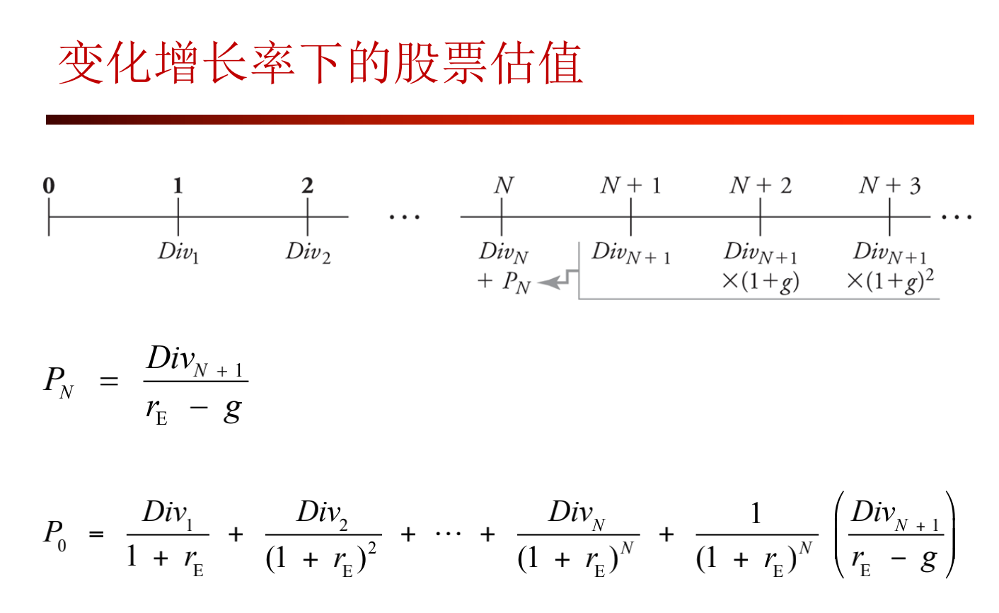
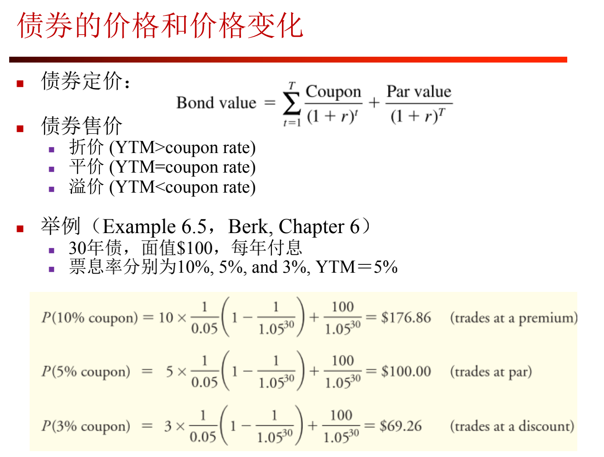

## 第一章习题

### 1 投资资产

衰退：债券

复苏：股票

过热：商品

滞涨：现金

### 2 年金PV

N期PV年金；

C现值（每期期末付款额）；r回报率；g增长率

$FV=PV(1+r)^N$：在N年后的价值

### 3有效年利率EAR、名义年利率APR

k：每年付款次数，k越大（计息周期越短）EAR越大

计算PV时使用$r=\frac{EAR}{k}$

EAR用于复利计算

EAR>APR

有效月利率=$(1+EAR)^\frac{1}{12}-1$

## 第二章习题

### 1 判断题

公司减少分红增加投资，若NPV为正，估值上升

常数增长率股利贴现模型：估值与股息增长率正相关

动态市盈率基于未来盈利情况

股息收益率=年股息/当期股价

利润留存率：税后净利润中用于保留盈余、扩展经营的比例

### 2 股利贴现模型

* 零增长（股利稳定）
* 单期

**$r_E$：回报率（资本成本cost of capital）**

$P_{0}$：估值	

$\frac{Div_1}{P_0}$：股息收益率

$\frac{P_1-P_0}{P_0}$：资本利得率

* 多期估值

* 常数增长率

  

  $g$：股息增长率

$\frac{Div_k}{Div_{k-1}}=g$代入得第一章2的PV公式

### 3 变化股息增长率

$PV_5=\frac{Div_5}{r_E-g}$

### 4

净现值NPV=获益/(1+r)^N^－成本，若大于0则投资

收益率=(获益-成本)/成本，几何平均收益率=(1+收益率)^1/N^－1

 1

### 5

估值三角：未来现金流、股价、资本成本（回报率），互相有关系但不互相决定

## 第三章习题

### 1 判断题

美联储主要通过调节联邦基金利率（同业拆借）影响其他利率

投资者对于利率水平的预期将影响收益率曲线的形状

* 利率期限结构：某一时点不同期限资金的**收益率与到期期限**之间的关系。
* 预期理论和流动性偏好理论是解释利率期限结构的两个不同的理论。
* 预期理论认为，**长期利率是市场平均预期的未来短期利率**。预期理论假设市场上没有流动性溢价，即投资者对于不同期限的债券没有偏好。预期理论常常用来解释**不同期限的利率同向变动**，但预期理论不能解释利率期限结构通常是向上倾斜的。
* 流动性偏好理论认为人们对于不同期限的债券的偏好不同，人们更**偏好流动性好的短期债券**，因此，为了吸引人们投资长期债券，往往需要给**长期债券一个流动性溢价**，即利率期限结构是**向上倾斜**的，流动性偏好理论不能解释利率期限结构向下倾斜的情况

量化宽松：央行在零利率或近似零利率政策后，通过购买国债等中长期债券，增加基础货币供给

可赎回债：债务方可按约定价格提前偿还（若预期利率下降，可以降低融资成本）

可卖回债：债权方可按约定价格要求偿还

票息率越高，久期越短，更大一部分现金流在近的时间折现，价格对利率变动更不敏感

期限越长，价格对利率变动更敏感

价格越低，YTM越大，价格对利率变动更不敏感

利率债有国家信用背书，主要包括国债、地方政府债券、政策性金融债和央行票据等，几乎只有利率风险；

信用债无国家信用背书，主要包括公司债以及企业债等，有信用风险及利率风险。

债券利率的决定因素包括 6 点：实际利率，预期未来**通胀**溢价，**利率风险**溢价，**违约风险**溢价，**税负**溢价，**流动性**溢价。

长期债券利率变动所带来的损失大于短期债券。投资者意识到这种风险，所以他们要求额外的收益，来作为承担这些风险的补偿。这种额外的补偿就叫做利率风险溢价，也叫做到期风险溢价。到期**期限越长，利率风险越大**，所以到期风险溢价与到期期限成正比。

从无风险投资到风险投资所赚取的额外报酬率，即承担风险的报酬，被称为风险溢价。风险溢价主要由违约风险和期限风险构成。对信用风险所要求的额外补偿叫做违约风险溢价。

### 2 名义年利率

$r_r$：实际利率

$r$：名义利率

$i$：通胀率

名义利率、通胀率的绝对值很小时才可近似

### 3 票息、YTM、债券售价

票息=票息率*面值/每年付款次数

IRR：使NPY为0的YTM。获益/(1+IRR)^N^=成本

* $YTM$：可以认为是$r_E$

* n年零息债券：$P(1+YTM_n)^n=FV$

**r用YTM，Coupon用票息率**

零息债券价格一般低于面值

### 4 利率风险

### 5 久期

半年付息：YTM除以2

猜测未来利率有很高的可能性会上升，应该选择久期短的

### 6 远期利率

## 第四章

### 1 MM定理

在完美资本市场中，公司的**总价值**等于其资产所产生的**全部现金流的市场价值**，不受公司资本结构选择的影响

（PPT 表述：股债的选择对公司价值没有影响，只改变股债分配；在完美资本市场条件下，杠杆不会影响公司的价值）

假设：（竞争性市场、没有信息不对称、无税收和交易成本）

（1） 投资者和公司能够以**竞争性的市场价格买卖同一集合**的证券，竞争性的市价等于证券产生的未来现金流的现值

（2） 没有**税负**、**交易成本**以及与证券交易相关的**发行成本**

（3） 公司的**融资决策**不改变其投资所产生的**现金流**，也不会揭示**有关投资的新信息**

在公司没有违约风险的情况下，杠杆会增加公司股权的风险

现实情况下股票和债券的不同：固定支付、期限、税盾、违约风险、剩余索取权

### 2 权衡理论

综合考虑杠杆的利息**税盾收益**与**财务困境成本**，以确定公司最大化其价值

 $V ^L=V^U + PV (Interest Tax Shield) − PV (Financial Distress Costs) $

 最优杠杆水平：增加杠杆直到财务风险成本和税收规避收益平衡，公司价值达到最大

### 3 代理人问题

从代理人问题的角度阐述债务的好处（代理人成本、激励、自由现金流假说）

自由现金流假说：

（1）债务带来的偿还压力可以**抑制自由现金流**，减小经理人的浪费空间

（2）债务压力本身会**激励**经理人认真工作。对位置稳定的经理人：债务带来的财务风险会促使经理人更加认真工作以抵御“失位”风险；对位置不稳定的经理人：债券带来的盈利压力可以使经理人更加在意绩效

（3）利用**债权人**对经理人的监督作用，降低股东的监督成本

### 4

投资负NPV称为过度投资

融资顺序假说认为债券融资比股权融资优先

公司没有义务必须分红

大公司的经理人可能会进行一些大规模、不盈利的投资决策

信息不对称、逆向选择时融资顺序：内部留存收益、发行公司债券、发行可转换债券、公开增发新股

### 5

税盾价值 = 债务利息费用 * 税率

低债务：如生物科技公司。有**较高的人力资本**，有**很大的财务困境成本**，此外，这类公司的经营策略风险容易加大，因此，这类公司的债务**代理成本高。**

高债务：有**稳定现金流和大量有形资产**的低成长的成熟公司，一般有较多的自由现金流，税盾和杠杆的激励收益可能会更高，这类公司的**债务困境成本一般比较低。**

4.7 4.9 4.10题