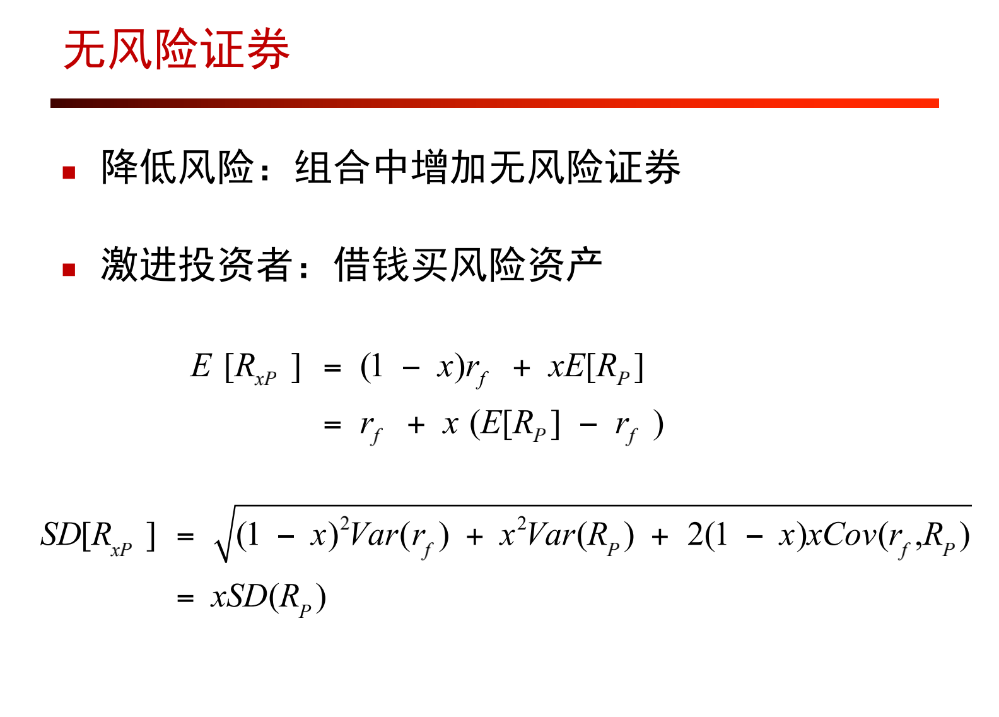
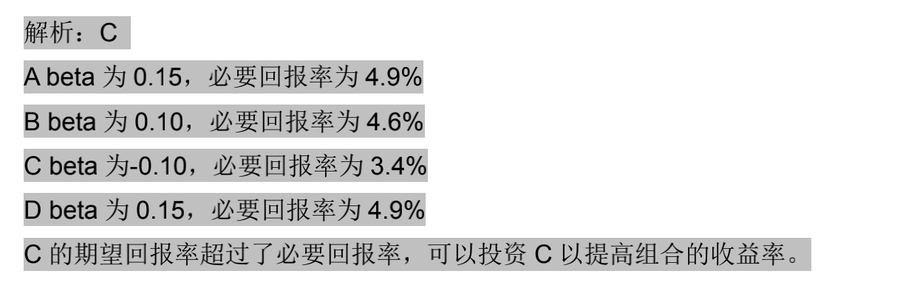
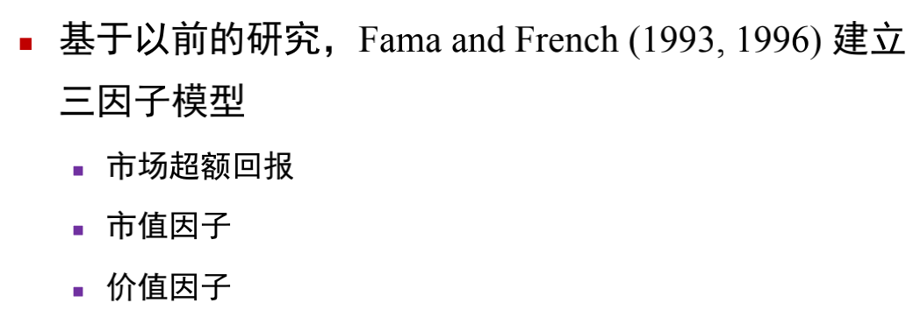
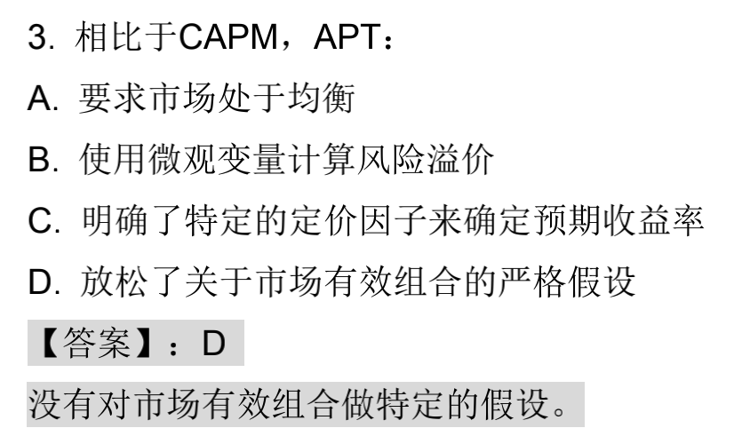
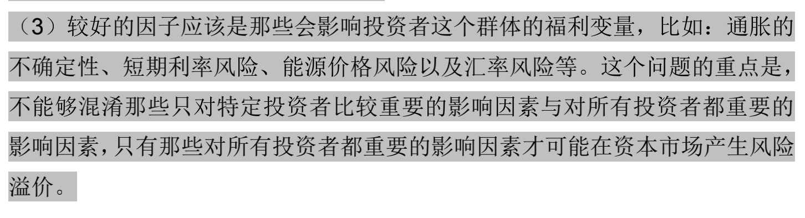
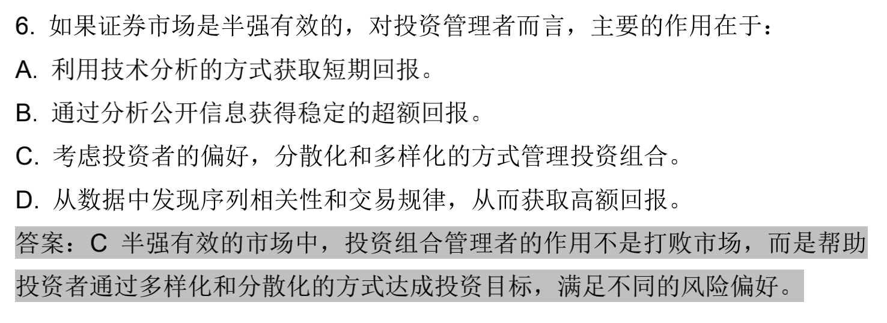

## 第七章 投资理论

特有风险：源自企业特有冲击

系统风险：源自市场共有冲击

多只资产形成组合，个体风险相互抵消，系统风险依然存在

风险溢价：特有风险没有溢价，风险溢价只能来自系统风险

 

期望收益=投资组合收益的加权平均

投资组合标准差=风险资产权重*风险资产标准差（方差的平方根）

## 第八章 CAPM

CAPM 模型认为资产组合收益可以由**系统风险**解释。

任一证券的风险溢价正比于市场组合的风险溢价，比值为β

用无风险利率和历史风险溢价画SML线，无风险利率用美国国库证券，历史风险溢价用标准普尔500

**假设：**均值方差优化框架

同质化信念

无摩擦竞争性市场（无税负交易成本）

**结论：**市场组合是最优风险组合

期望回报和β为线性关系

证明：

CML线：

（即斜率为市场组合收益率的夏普比率，y轴截距为无风险利率）

即p的夏普比率和市场组合相同

**某股票总风险 = 非系统性风险+β^2^×市场组合标准差^2^ = 收益率标准差^2^**

即α=实际收益率 - 用β算出来的收益率

## 第九章 多因子模型

CAPM（资本资产定价模型）需要均值方差有效市场组合，需要证券收益正态分布，假定特殊因素解释证券收益，而套利定价都不需要

证券特征线SCL：$R_A-R_f=\beta (R_M-R_f)+e_A$，$e_A$为特有风险

## 第十章 EMH有效市场假说

