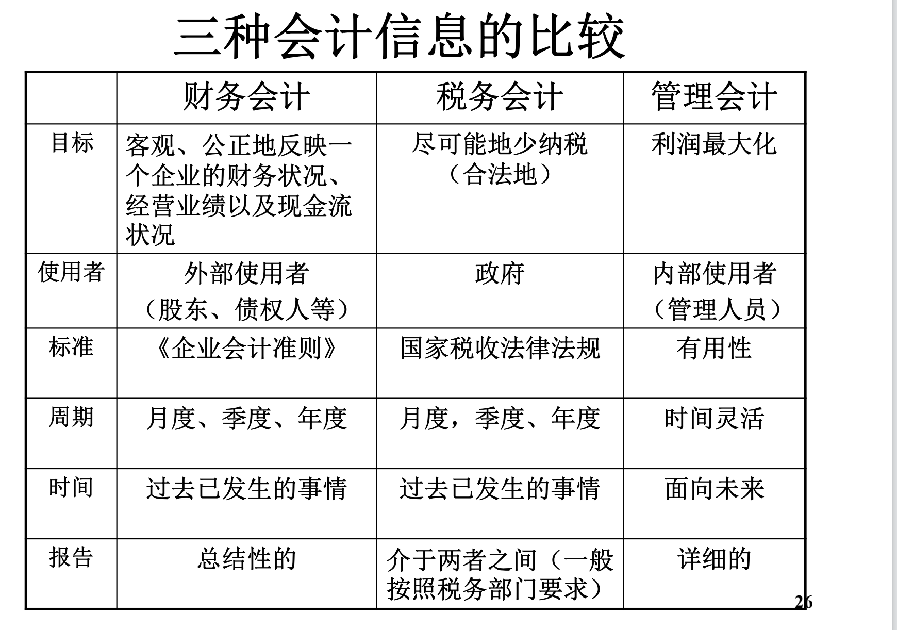

## 会计要素

资产：企业拥有或控制、预期带来经济利益（很可能流入企业、成本可以衡量）

* 流动资产（一年/一个周期可以变现/出售/耗用、交易目的持有）
* 非流动资产

负债：现实义务（借的、欠的、该交的 预收的），经济利益流出企业

所有者权益（股东权益）：两项相减

* 投资者投入资本
* 生产经营所得
* 特殊交易

收入：*日常活动中、与所有者投入资本无关的*所有者权益增加

* 主营业务收入
* 其他业务收入

费用：*日常活动中、与向所有者分配利润无关的*所有者权益减少

* 主营业务成本
* 其他业务成本
* 营业、税金、销售、管理、研发、财务、所得税

利润：**收入-费用+计入当期损益的利得-计入当期损益的损失**，一段时间内经营成果

* 利润总额=上式费用里不含所得税
* 净利润=利润总额-所得税

利得：除收入和所有者投入资本，偶然因素的经济利益流入

损失：除费用和所有者分配利润，偶然因素的经济利益留出

* 计入当期损益：影响净利润
* 不计入当期损益：直接影响所有者权益

## 会计基础

权责发生制：以发生时间来确认 —— 应收账款、应付账款

收付实现制：以收款时间来确认

资产=负债+所有者权益 —— 永久类账户

收入、费用 —— 暂时性账户

**资产+费用=负债+资本+期初留存收益+收入+其他综合收益**

左侧借增贷减，右侧借减贷增

## 所有者权益

实收资本/股本

其他权益工具

资本公积

库存股

其他综合收益

盈余公积

未分配陆润

现金流量是收付实现制

资产负债表、利润表、所有者权益变动表是权责发生制

